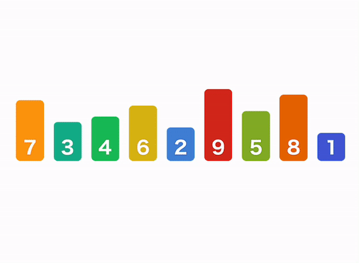
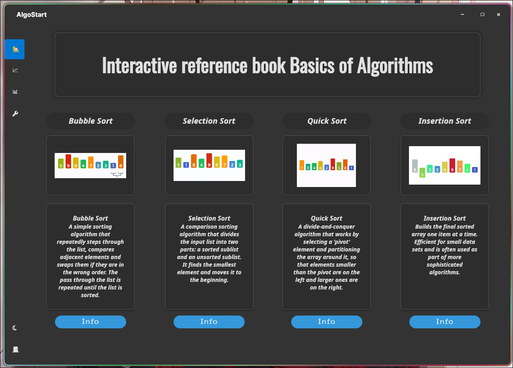
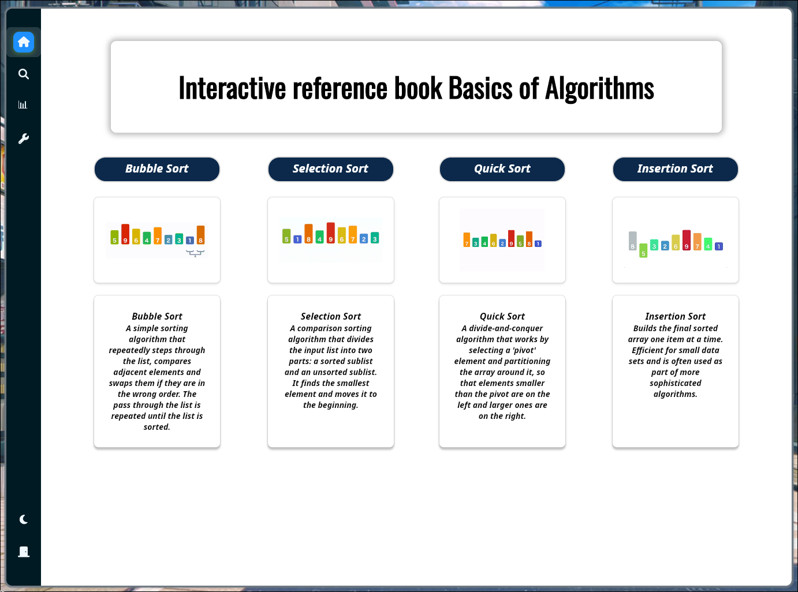
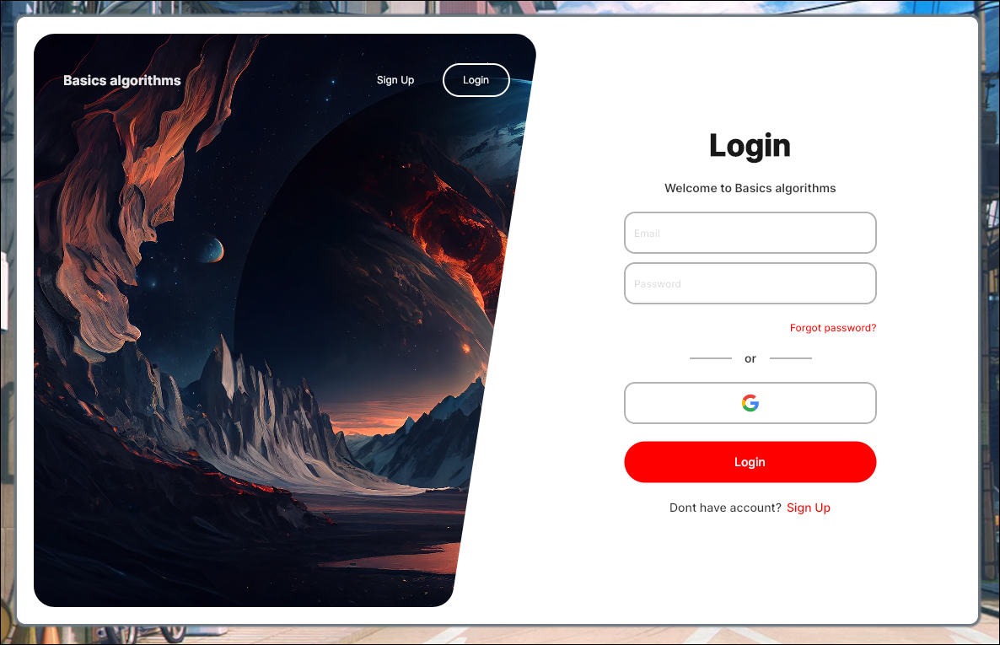
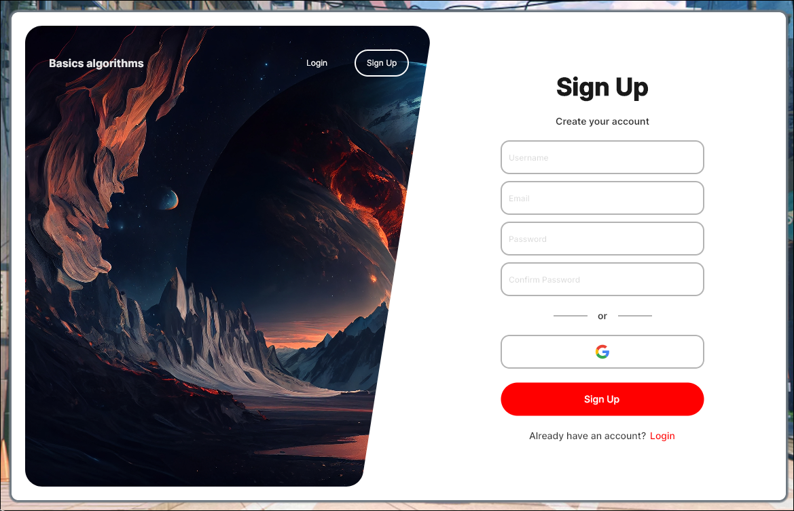

# 📊 SortProgram - Візуалізація алгоритмів сортування

<div align="center">
  
  
  
  
</div>

## 🚀 Опис проекту

**SortProgram** - це інтерактивний довідник з алгоритмів сортування, розроблений з використанням Avalonia UI. Програма надає візуальне представлення різних алгоритмів сортування, їх детальний опис, можливість вивчити їх роботу покроково та порівняти їх продуктивність.

## ✨ Особливості

- **📱 Сучасний інтерфейс користувача** - стильний дизайн з підтримкою світлої (чисто білої #FFFFFF) та темної теми (стандартної сірої #121212)
- **🔄 Анімовані візуалізації** - наочні демонстрації роботи алгоритмів
- **📈 Статистика продуктивності** - порівняння швидкості різних алгоритмів
- **📖 Детальні описи** - вичерпна інформація про кожен алгоритм
- **🏁 Режим тестування** - можливість перевірити алгоритми на різних наборах даних
- **🔐 Система авторизації** - форми входу та реєстрації з підтримкою email для персоналізованого досвіду
- **🎓 Інтерактивне навчання** - покрокова візуалізація роботи алгоритмів
- **🧩 Архітектура MVVM** - чітке розділення логіки та представлення для кращої підтримки коду

## 🧮 Підтримувані алгоритми

- **Bubble Sort** - простий алгоритм сортування, що проходить через список, порівнює сусідні елементи і міняє їх місцями
- **Selection Sort** - алгоритм, що розділяє вхідний список на відсортовану та невідсортовану частини
- **Quick Sort** - швидкий алгоритм за принципом "розділяй і володарюй"
- **Insertion Sort** - алгоритм, що будує кінцевий відсортований масив по одному елементу

## 🔍 Інтерактивна візуалізація Bubble Sort

<div align="center">
  
</div>

Програма пропонує інтерактивну візуалізацію алгоритму бульбашкового сортування зі наступними можливостями:

- **📊 Графічне представлення масиву** - елементи відображаються як стовпчики різної висоти
- **⏯️ Керування анімацією** - запуск, пауза та покроковий режим
- **🎚️ Налаштування швидкості** - регулювання темпу анімації
- **📏 Вибір розміру масиву** - від 5 до 50 елементів
- **🎲 Різні типи вхідних даних** - випадковий, майже відсортований, зворотний порядок та інші
- **📝 Підсвічування псевдокоду** - синхронізований із анімацією для кращого розуміння
- **🔢 Статистика виконання** - лічильники порівнянь, обмінів та ітерацій
- **🔤 Кольорове кодування** - для відстеження поточного стану елементів

## 🔧 Технології та архітектура

- **Avalonia UI** - крос-платформний UI фреймворк
- **C#** - основна мова програмування
- **.NET** - програмна платформа
- **MVVM (Model-View-ViewModel)** - архітектурний патерн для чіткого розділення логіки та представлення
- **Реактивні команди** - для обробки дій користувача
- **PerformanceTimer** - для точного вимірювання продуктивності з можливістю паузи та відновлення

## 📋 Вимоги до системи

- Windows, macOS або Linux
- .NET SDK 6.0 або новіше

## 📥 Встановлення

1. Клонуйте репозиторій:
   ```
   git clone https://github.com/NotionMe/SortProgram.git
   ```

2. Відкрийте проект у Visual Studio або JetBrains Rider

3. Встановіть необхідні пакети NuGet

4. Запустіть проект

## 📷 Скріншоти

<div align="center">
  
  
</div>

### 🔐 Форми автентифікації

<div align="center">
  
  
</div>

Програма має систему автентифікації з двома основними формами:
- **LoginMenu** - форма входу для існуючих користувачів з полями для імені користувача, email та пароля
- **SignInMenu** - форма реєстрації для нових користувачів

Обидві форми мають сучасний дизайн з використанням общих компонентів стилів та адаптивний інтерфейс.

## 🧭 Навігація

Програма має сучасне бічне меню (sidebar) з наступними пунктами:
- **Home** - головна сторінка програми
- **Sorting** - сторінка з алгоритмами сортування
- **Statistics** - сторінка зі статистикою продуктивності
- **Settings** - сторінка налаштувань

Меню має стильний дизайн з темно-сірим фоном (#121212), синім виділенням активного пункту (#0078D4) та анімацією відкриття/закриття.

## 📝 Структура проекту

```
SortProgram/
├── Algorithms/              # Алгоритми сортування
├── Assets/                  # Ресурси програми
│   └── Images/              # Зображення та анімації
├── Auth/                    # Компоненти авторизації
│   ├── LoginMenu.axaml      # Форма входу
│   └── SignInMenu.axaml     # Форма реєстрації
├── Fonts/                   # Шрифти для програми
├── Pages/                   # Сторінки програми
│   ├── HomePage.axaml       # Головна сторінка програми
│   ├── SettingsPage.axaml   # Сторінка налаштувань
│   ├── SortingAlgorithmsPage.axaml # Сторінка з алгоритмами сортування
│   ├── StatisticsPage.axaml # Сторінка зі статистикою
│   ├── Info/                # Інформаційні сторінки
│   │   ├── InfoBubbleSort.axaml # Інформація про Bubble Sort
│   │   └── ComparisonPage.axaml # Сторінка порівняння алгоритмів
│   └── Visualizations/      # Візуалізації алгоритмів
│       └── BubbleSort.axaml # Візуалізація Bubble Sort
├── Styles/                  # Стилі програми
│   ├── Components/          # Компоненти стилів
│   │   ├── ButtonStyles.axaml  # Стилі кнопок
│   │   ├── CardStyles.axaml    # Стилі карток
│   │   ├── FormStyles.axaml    # Стилі форм
│   │   └── NavigationStyles.axaml # Стилі навігації
│   ├── Resources/           # Ресурси стилів
│   ├── Themes/              # Теми програми
│   │   ├── DarkTheme.axaml  # Темна тема
│   │   └── LightTheme.axaml # Світла тема
│   ├── Colors.axaml         # Кольори програми
│   ├── GlobalStyles.axaml   # Глобальні стилі
│   └── Sidebar.axaml        # Стилі бічного меню
├── Utils/                   # Утиліти та допоміжні класи
├── ViewModels/              # Моделі представлення (MVVM)
│   ├── BubbleSortViewModel.cs # Модель представлення для Bubble Sort
│   └── ViewModelBase.cs     # Базовий клас для моделей представлення
├── App.axaml                # Головний файл додатку
└── MainWindow.axaml         # Головне вікно програми
```

## 📚 Ліцензія

Цей проект розповсюджується під ліцензією MIT. Дивіться файл LICENSE для отримання додаткової інформації.

## 👤 Автор

- **Станіслав Убогий** - Practika2_OPAM_Ubohyi_Stanislav

## 🤝 Внесок

Вітаються запити на витягування. Для серйозних змін спочатку створіть проблему, щоб обговорити, що ви хотіли б змінити.

---

<div align="center">
  <i>© 2025 SortProgram. Всі права захищені.</i>
</div>
