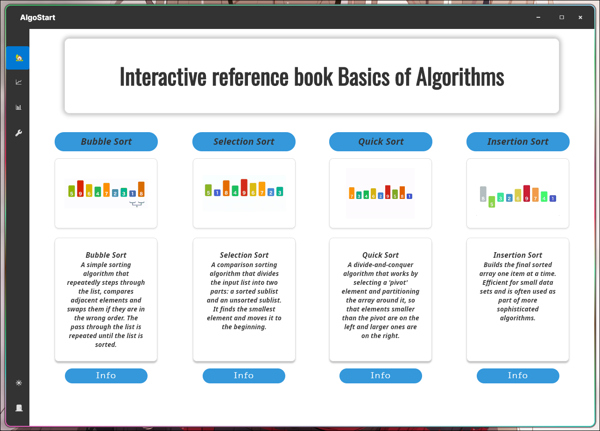

# 🧠 AlgoStart - Інтерактивна навчальна платформа з алгоритмів сортування

<div align="center">
  
  
  
  [](https://opensource.org/licenses/MIT)
  [](https://avaloniaui.net/)
  [](https://github.com/ubohyi/SortProgram)

</div>

---

## 📝 Опис проекту

AlgoStart - це навчальна платформа, розроблена для вивчення та демонстрації алгоритмів сортування. Проект створено з використанням сучасних технологій інтерфейсу та анімацій для наочного представлення роботи алгоритмів.

> 💡 **Головна ідея**: Зробити процес вивчення алгоритмів сортування максимально наочним та інтерактивним

## ✨ Основні функції

<details>
<summary>🎬 <b>Інтерактивна візуалізація алгоритмів</b></summary>
<br>
Наочні анімації роботи різних алгоритмів сортування, які допомагають зрозуміти принципи їх роботи на практиці.
</details>

<details>
<summary>📚 <b>Детальні статті</b></summary>
<br>
Теоретичні матеріали з поясненнями кожного алгоритму, математичні обґрунтування та аналіз складності.
</details>

<details>
<summary>🌓 <b>Темна та світла теми</b></summary>
<br>
Комфортне використання додатку при різному освітленні, налаштування інтерфейсу під особисті вподобання.
</details>

<details>
<summary>📱 <b>Адаптивний інтерфейс</b></summary>
<br>
Зручне використання на різних пристроях завдяки гнучкому та адаптивному дизайну інтерфейсу.
</details>

<details>
<summary>📊 <b>Статистика ефективності</b></summary>
<br>
Порівняння швидкодії різних алгоритмів сортування з візуалізацією результатів.
</details>

## 🔄 Реалізовані алгоритми

| Алгоритм | Складність (середня) | Просторова складність | Стабільність |
|----------|:--------------------:|:---------------------:|:------------:|
| 🫧 **Bubble Sort** | O(n²) | O(1) | ✅ Стабільний |
| 🔍 **Selection Sort** | O(n²) | O(1) | ❌ Нестабільний |
| ⚡ **Quick Sort** | O(n log n) | O(log n) | ❌ Нестабільний |
| 📋 **Merge Sort** | O(n log n) | O(n) | ✅ Стабільний |
| 🪣 **Bucket Sort** | O(n+k) | O(n+k) | ✅ Стабільний |

## 🛠️ Технології

<div align="center">
  
  
  
  
  
  
</div>

- 💻 **Мова програмування**: C#
- 🖼️ **Фреймворк інтерфейсу**: Avalonia UI
- 🏗️ **Архітектура**: MVVM (Model-View-ViewModel)
- 🎨 **Графічні ресурси**: XAML та вбудовані анімації

## 💻 Системні вимоги

- 🔷 .NET 6.0 або новіше
- 🖥️ Windows, macOS або Linux (кросплатформний)

## 🚀 Встановлення та запуск

<details>
<summary>Розгорнути інструкції з встановлення</summary>

1. Клонуйте репозиторій:
```bash
git clone https://github.com/ваш-логін/algostart.git
```

2. Відкрийте проект у Visual Studio або JetBrains Rider

3. Відновіть пакети NuGet

4. Скомпілюйте та запустіть проект:
```bash
dotnet run
```

</details>

## 📂 Структура проекту

```
SortProgram/
├── 📁 Pages/                 # Сторінки додатку
├── 📁 Styles/                # Стилі та теми
│   ├── 📁 Themes/            # Темна та світла теми
│   └── 📁 Components/        # Стилі компонентів
├── 📁 Image/                 # Зображення та анімації
├── 📁 Fonts/                 # Шрифти
├── 📄 App.axaml              # Конфігурація додатку
├── 📄 App.axaml.cs           # Код конфігурації додатку
├── 📄 MainWindow.axaml       # Головне вікно
└── 📄 MainWindow.axaml.cs    # Код головного вікна
```

## 📱 Використання

<div align="center">
  <table>
    <tr>
      <td align="center">🏠</td>
      <td><b>Головна сторінка</b> - загальна інформація про проект</td>
    </tr>
    <tr>
      <td align="center">📈</td>
      <td><b>Алгоритми сортування</b> - список доступних алгоритмів з описом</td>
    </tr>
    <tr>
      <td align="center">📖</td>
      <td><b>Перегляд статті</b> - детальний опис алгоритму з візуалізацією</td>
    </tr>
    <tr>
      <td align="center">📊</td>
      <td><b>Статистика</b> - порівняльні характеристики алгоритмів</td>
    </tr>
    <tr>
      <td align="center">⚙️</td>
      <td><b>Налаштування</b> - зміна теми та інші параметри</td>
    </tr>
  </table>
</div>

## 🖼️ Скріншоти

<div align="center">
  <p><i>Приклади інтерфейсу програми:</i></p>
  
  | 🌞 Світла тема | 🌙 Темна тема |
  |----------------|---------------|
  |  |  |
  
</div>

## 👨‍💼 Авторство та ліцензія

<div align="center">
  
  © 2024 Станіслав Убогий
  
  
  
</div>

Проект розроблено в рамках навчальної програми з об'єктно-орієнтованого програмування та аналізу алгоритмів.

## 🔮 Плани розвитку

- [ ] ➕ Додавання нових алгоритмів сортування
- [ ] 🧩 Реалізація інтерактивних вправ для закріплення знань
- [ ] 🔄 Додавання можливості змінювати вхідні дані для алгоритмів
- [ ] 🧪 Розробка модуля для тестування знань користувача

## 🤝 Внесок у проект

Якщо ви бажаєте зробити внесок у проект, будь ласка:

1. Створіть форк проекту
2. Створіть нову гілку для вашої функції (`git checkout -b feature/AmazingFeature`)
3. Зробіть коміт ваших змін (`git commit -m 'Add some AmazingFeature'`)
4. Відправте зміни у вашу гілку (`git push origin feature/AmazingFeature`)
5. Відкрийте Pull Request

---

<div align="center">
  
  *Дякую за використання AlgoStart! Для пропозицій та зауважень створюйте issue або відправляйте pull request.* 🙏
  
  
  
</div> 