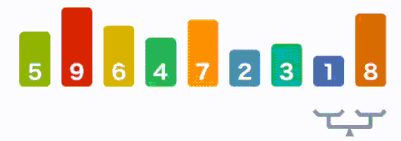
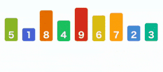
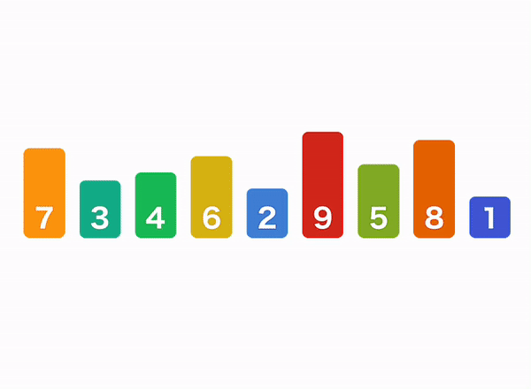
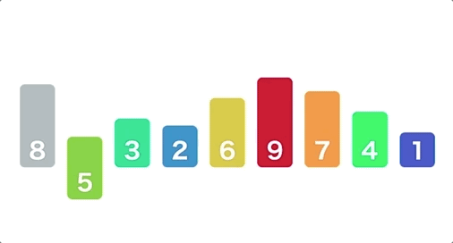
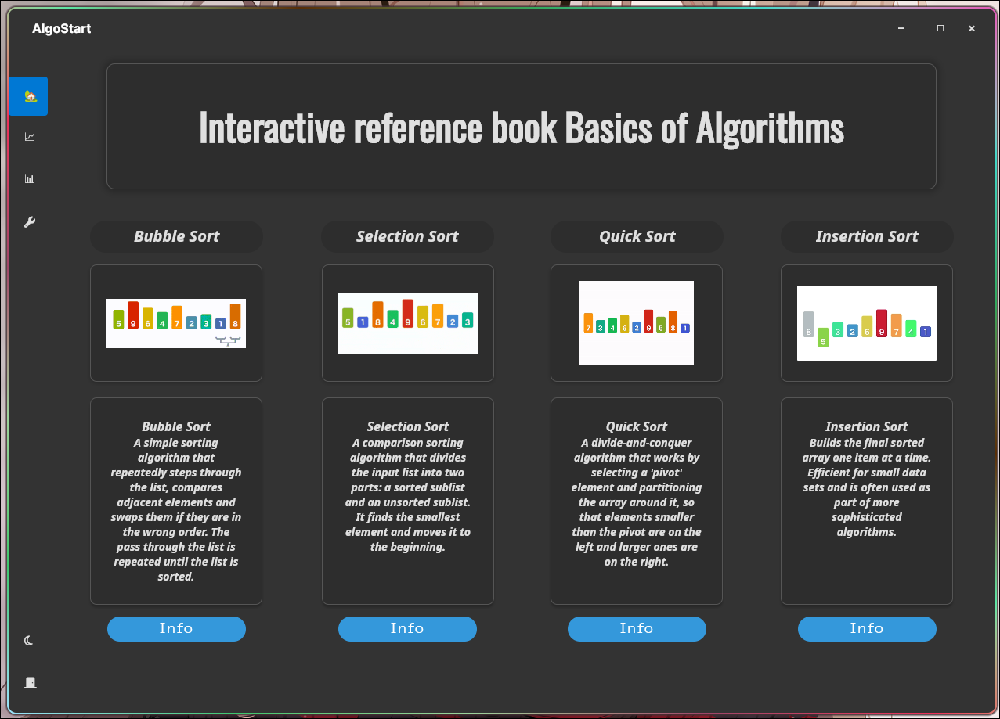

# 📊 SortProgram - Візуалізація алгоритмів сортування

<div align="center">
  
  
  
  
</div>

## 🚀 Опис проекту

**SortProgram** - це інтерактивний довідник з алгоритмів сортування, розроблений з використанням Avalonia UI. Програма надає візуальне представлення різних алгоритмів сортування, їх детальний опис, можливість вивчити їх роботу покроково та порівняти їх продуктивність.

## ✨ Особливості

- **📱 Сучасний інтерфейс користувача** - стильний дизайн з підтримкою світлої та темної теми
- **🔄 Анімовані візуалізації** - наочні демонстрації роботи алгоритмів
- **📈 Статистика продуктивності** - порівняння швидкості різних алгоритмів
- **📖 Детальні описи** - вичерпна інформація про кожен алгоритм
- **🏁 Режим тестування** - можливість перевірити алгоритми на різних наборах даних

## 🧮 Підтримувані алгоритми

- **Bubble Sort** - простий алгоритм сортування, що проходить через список, порівнює сусідні елементи і міняє їх місцями
- **Selection Sort** - алгоритм, що розділяє вхідний список на відсортовану та невідсортовану частини
- **Quick Sort** - швидкий алгоритм за принципом "розділяй і володарюй"
- **Insertion Sort** - алгоритм, що будує кінцевий відсортований масив по одному елементу

## 🔧 Технології

- **Avalonia UI** - крос-платформний UI фреймворк
- **C#** - основна мова програмування
- **.NET** - програмна платформа

## 📋 Вимоги до системи

- Windows, macOS або Linux
- .NET SDK 6.0 або новіше

## 📥 Встановлення

1. Клонуйте репозиторій:
   ```
   git clone https://github.com/username/SortProgram.git
   ```

2. Відкрийте проект у Visual Studio або JetBrains Rider

3. Встановіть необхідні пакети NuGet

4. Запустіть проект

## 📷 Скріншоти

<div align="center">
  
  
</div>

## 📝 Структура проекту

```
SortProgram/
├── Assets/                  # Ресурси програми
│   └── Images/              # Зображення та анімації
├── Fonts/                   # Шрифти для програми
├── Pages/                   # Сторінки програми
├── Styles/                  # Стилі програми
│   ├── Components/          # Компоненти стилів
│   ├── Resources/           # Ресурси стилів
│   └── Themes/              # Теми програми
```

## 📚 Ліцензія

Цей проект розповсюджується під ліцензією MIT. Дивіться файл LICENSE для отримання додаткової інформації.

## 👤 Автор

- **Станіслав Убогий** - Practika2_OPAM_Ubohyi_Stanislav

## 🤝 Внесок

Вітаються запити на витягування. Для серйозних змін спочатку створіть проблему, щоб обговорити, що ви хотіли б змінити.

---

<div align="center">
  <i>© 2023 SortProgram. Всі права захищені.</i>
</div>
