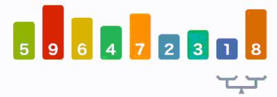
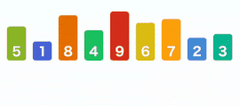
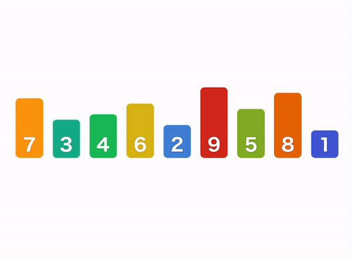
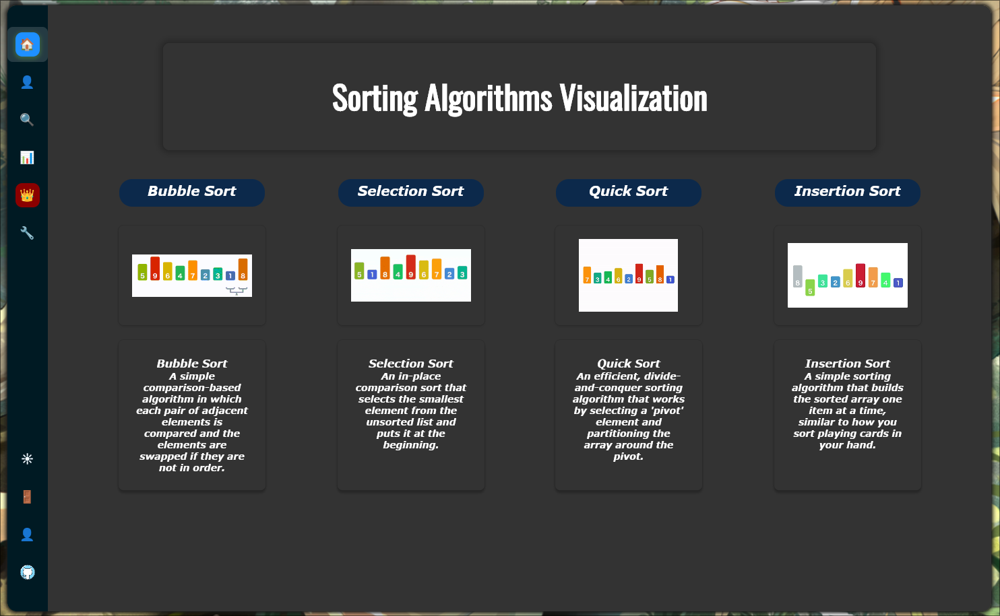
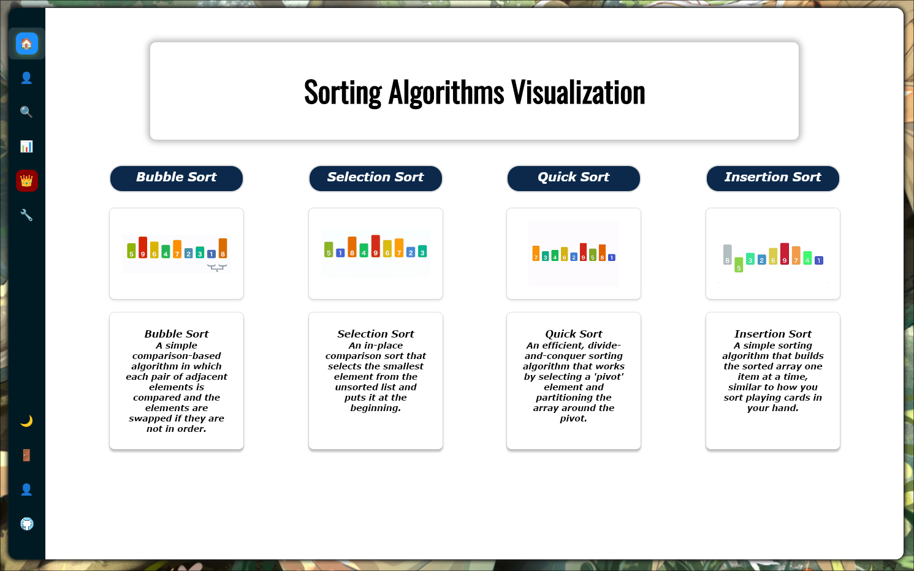
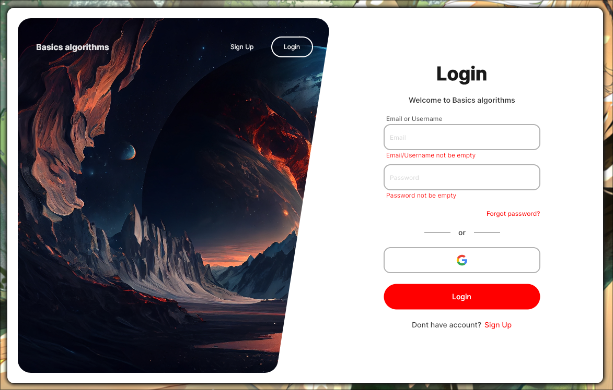
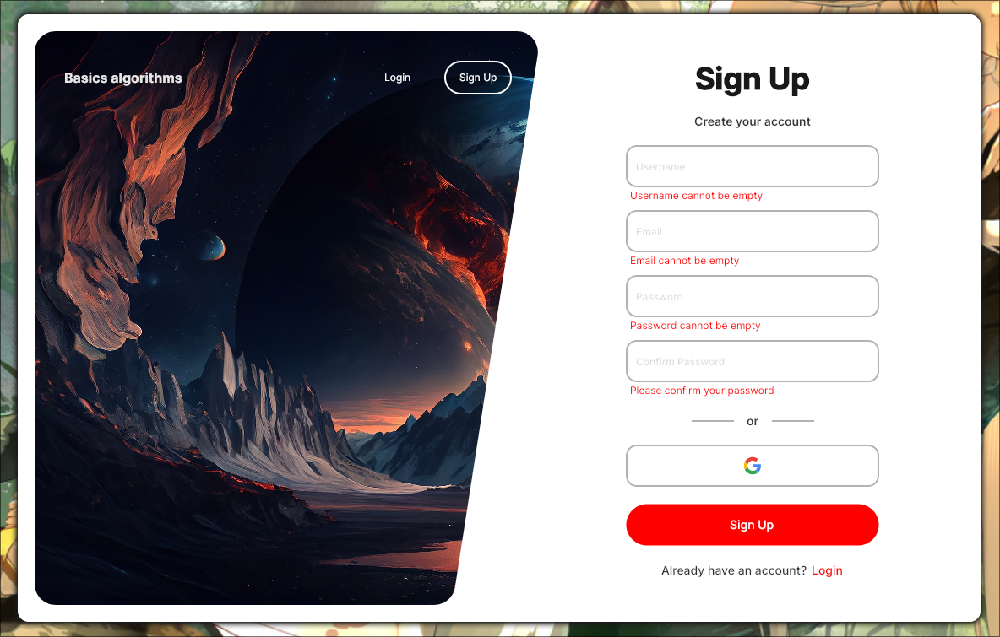

# 📊 SortProgram - Візуалізація алгоритмів сортування

<div align="center">
  
  
  
  
</div>

## 📑 Зміст
- [📊 SortProgram - Візуалізація алгоритмів сортування](#-sortprogram---візуалізація-алгоритмів-сортування)
  - [📑 Зміст](#-зміст)
  - [🚀 Опис проекту](#-опис-проекту)
  - [✨ Особливості](#-особливості)
  - [🧮 Підтримувані алгоритми](#-підтримувані-алгоритми)
  - [🔍 Інтерактивна візуалізація](#-інтерактивна-візуалізація)
  - [🔧 Технології та архітектура](#-технології-та-архітектура)
  - [📋 Вимоги до системи](#-вимоги-до-системи)
  - [📥 Встановлення](#-встановлення)
  - [📷 Скріншоти](#-скріншоти)
    - [Основний інтерфейс](#основний-інтерфейс)
    - [🔐 Форми автентифікації](#-форми-автентифікації)
  - [🧭 Навігація](#-навігація)
  - [🌍 Локалізація](#-локалізація)
  - [🎨 Теми оформлення](#-теми-оформлення)
  - [📝 Структура проекту](#-структура-проекту)
  - [📚 Ліцензія](#-ліцензія)
  - [👤 Автор](#-автор)
  - [🤝 Внесок](#-внесок)

## 🚀 Опис проекту

**SortProgram** - це інтерактивний довідник з алгоритмів сортування, розроблений з використанням Avalonia UI. Програма надає візуальне представлення різних алгоритмів сортування, їх детальний опис, можливість вивчити їх роботу покроково та порівняти їх продуктивність.

## ✨ Особливості

- **📱 Сучасний інтерфейс користувача** - стильний дизайн з підтримкою світлої (чисто білої #FFFFFF) та темної теми (стандартної сірої #121212)
- **🔄 Анімовані візуалізації** - наочні демонстрації роботи алгоритмів
- **📈 Статистика продуктивності** - порівняння швидкості різних алгоритмів
- **📖 Детальні описи** - вичерпна інформація про кожен алгоритм
- **🏁 Режим тестування** - можливість перевірити алгоритми на різних наборах даних
- **🔐 Система авторизації** - форми входу та реєстрації з підтримкою email для персоналізованого досвіду
- **🎓 Інтерактивне навчання** - покрокова візуалізація роботи алгоритмів
- **🧩 Архітектура MVVM** - чітке розділення логіки та представлення для кращої підтримки коду
- **🌐 Багатомовність** - підтримка української та англійської мов
- **🔄 Профіль користувача** - можливість зберігати прогрес та налаштування

## 🧮 Підтримувані алгоритми

- **Bubble Sort** - простий алгоритм сортування, що проходить через список, порівнює сусідні елементи і міняє їх місцями
- **Selection Sort** - алгоритм, що розділяє вхідний список на відсортовану та невідсортовану частини
- **Quick Sort** - швидкий алгоритм за принципом "розділяй і володарюй"
- **Insertion Sort** - алгоритм, що будує кінцевий відсортований масив по одному елементу

## 🔍 Інтерактивна візуалізація

<div align="center">
  
</div>

Програма пропонує інтерактивну візуалізацію алгоритмів сортування зі наступними можливостями:

- **📊 Графічне представлення масиву** - елементи відображаються як стовпчики різної висоти
- **⏯️ Керування анімацією** - запуск, пауза та покроковий режим
- **🎚️ Налаштування швидкості** - регулювання темпу анімації
- **📏 Вибір розміру масиву** - від 5 до 50 елементів
- **🎲 Різні типи вхідних даних** - випадковий, майже відсортований, зворотний порядок та інші
- **📝 Підсвічування псевдокоду** - синхронізований із анімацією для кращого розуміння
- **🔢 Статистика виконання** - лічильники порівнянь, обмінів та ітерацій
- **🔤 Кольорове кодування** - для відстеження поточного стану елементів

## 🔧 Технології та архітектура

- **Avalonia UI 11.2** - крос-платформний UI фреймворк
- **C# та .NET 9.0** - сучасна мова програмування та платформа
- **MVVM (Model-View-ViewModel)** - архітектурний патерн для чіткого розділення логіки та представлення
- **ReactiveUI** - фреймворк для реактивного програмування
- **PerformanceTimer** - для точного вимірювання продуктивності з можливістю паузи та відновлення
- **BCrypt.Net-Next** - для безпечного хешування паролів
- **JSON** - для зберігання даних користувачів та налаштувань
- **Fluent Design** - сучасний дизайн інтерфейсу

## 📋 Вимоги до системи

- Windows, macOS або Linux
- .NET SDK 9.0 або новіше
- 2 ГБ оперативної пам'яті
- 1.5 GB вільного місця на диску

## 📥 Встановлення

1. Клонуйте репозиторій:
   ```
   git clone https://github.com/NotionMe/SortProgram.git
   ```

2. Відкрийте проект у Visual Studio або JetBrains Rider

3. Відновіть пакети NuGet:
   ```
   dotnet restore
   ```

4. Запустіть проект:
   ```
   dotnet run
   ```

## 📷 Скріншоти

### Основний інтерфейс

<div align="center">
  
  
</div>

### 🔐 Форми автентифікації

<div align="center">
  
  
</div>

Програма має систему автентифікації з двома основними формами:
- **LoginMenu** - форма входу для існуючих користувачів з полями для імені користувача, email та пароля
- **SignInMenu** - форма реєстрації для нових користувачів

Обидві форми мають сучасний дизайн з використанням спільних компонентів стилів та адаптивний інтерфейс.

## 🧭 Навігація

Програма має сучасне бічне меню (sidebar) з наступними пунктами:
- **Home** - головна сторінка програми
- **Sorting** - сторінка з алгоритмами сортування
- **Statistics** - сторінка зі статистикою продуктивності
- **Settings** - сторінка налаштувань
- **Profile** - сторінка профілю користувача

Меню має стильний дизайн з темно-сірим фоном (#121212), синім виділенням активного пункту (#0078D4) та анімацією відкриття/закриття.

## 🌍 Локалізація

Програма підтримує дві мови:
- **Українська** (uk.json)
- **Англійська** (en.json)

Всі тексти інтерфейсу зберігаються в JSON-файлах у директорії `Assets/Localization`. Для зміни мови використовуйте відповідний перемикач на сторінці налаштувань.

## 🎨 Теми оформлення

Доступні дві теми оформлення:
- **Світла тема** - з білим фоном (#FFFFFF) та темними елементами інтерфейсу
- **Темна тема** - з темно-сірим фоном (#121212) та світлими елементами інтерфейсу

Для зміни теми використовуйте перемикач на сторінці налаштувань або в верхньому меню.

## 📝 Структура проекту

```
SortProgram/
├── Algorithms/              # Алгоритми сортування
│   ├── BubbleSort.cs        # Реалізація бульбашкового сортування
│   ├── InsertionSort.cs     # Реалізація сортування вставками
│   ├── QuickSort.cs         # Реалізація швидкого сортування
│   └── SelectionSort.cs     # Реалізація сортування вибором
├── Assets/                  # Ресурси програми
│   ├── DataBase/            # База даних користувачів
│   │   └── users.json       # Дані користувачів
│   ├── Images/              # Зображення та анімації
│   │   ├── bubble_sort.gif  # Анімація бульбашкового сортування
│   │   ├── selection_sort.gif # Анімація сортування вибором
│   │   ├── quick_sort.gif   # Анімація швидкого сортування
│   │   ├── insertion_sort.gif # Анімація сортування вставками
│   │   ├── DarkMode.png     # Скріншот темної теми
│   │   ├── WhiteMode.png    # Скріншот світлої теми
│   │   ├── Login.png        # Скріншот форми входу
│   │   └── SignUp.png       # Скріншот форми реєстрації
│   │   └── Avatar/          # Аватари користувачів
│   └── Localization/        # Файли локалізації
│       ├── en.json          # Англійська локалізація
│       └── uk.json          # Українська локалізація
├── Auth/                    # Компоненти авторизації
│   ├── LoginMenu.axaml      # Форма входу
│   ├── LoginMenu.axaml.cs   # Логіка форми входу
│   ├── SignInMenu.axaml     # Форма реєстрації
│   ├── SignInMenu.axaml.cs  # Логіка форми реєстрації
│   ├── MessageBox.axaml     # Вікно повідомлень
│   └── User.cs              # Модель користувача
├── Converters/              # Конвертери для UI
│   └── LanguageConverter.cs # Конвертер для локалізації
├── Fonts/                   # Шрифти для програми
│   ├── AnonymousPro-Regular.ttf # Моноширинний шрифт
│   └── Oswald-VariableFont_wght.ttf # Шрифт для заголовків
├── Pages/                   # Сторінки програми
│   ├── HomePage.axaml       # Головна сторінка програми
│   ├── ProfilePage.axaml    # Сторінка профілю користувача
│   ├── SettingsPage.axaml   # Сторінка налаштувань
│   ├── SortingAlgorithmsPage.axaml # Сторінка з алгоритмами сортування
│   ├── StatisticsPage.axaml # Сторінка зі статистикою
│   ├── Admin/               # Адміністративні сторінки
│   │   └── RoleManagementPage.axaml # Управління ролями користувачів
│   ├── Info/                # Інформаційні сторінки
│   │   ├── InfoBubbleSort.axaml # Інформація про Bubble Sort
│   │   ├── InfoSelectionSort.axaml # Інформація про Selection Sort
│   │   ├── InfoQuickSort.axaml # Інформація про Quick Sort
│   │   ├── InfoInsertionSort.axaml # Інформація про Insertion Sort
│   └── Visualizations/      # Візуалізації алгоритмів
│       ├── BubbleSort.axaml # Візуалізація Bubble Sort
│       ├── SelectionSort.axaml # Візуалізація Selection Sort
│       ├── QuickSort.axaml  # Візуалізація Quick Sort
│       └── InsertionSort.axaml # Візуалізація Insertion Sort
├── Services/                # Сервіси програми
│   ├── AuthService.cs       # Сервіс автентифікації
│   ├── LanguageManager.cs   # Менеджер локалізації
│   ├── PasswordHasher.cs    # Хешування паролів
│   └── UserRepository.cs    # Робота з базою користувачів
├── Styles/                  # Стилі програми
│   ├── Components/          # Компоненти стилів
│   │   ├── ButtonStyles.axaml  # Стилі кнопок
│   │   ├── CardStyles.axaml    # Стилі карток
│   │   ├── FormStyles.axaml    # Стилі форм
│   │   └── NavigationStyles.axaml # Стилі навігації
│   ├── Resources/           # Ресурси стилів
│   │   └── Styles.axaml     # Загальні стилі
│   ├── Themes/              # Теми програми
│   │   ├── DarkTheme.axaml  # Темна тема
│   │   └── LightTheme.axaml # Світла тема
│   ├── Colors.axaml         # Кольори програми
│   ├── GlobalStyles.axaml   # Глобальні стилі
│   ├── Sidebar.axaml        # Стилі бічного меню
│   └── ThemeManager.cs      # Менеджер тем
├── Utils/                   # Утиліти та допоміжні класи
│   ├── ArrayGenerator.cs    # Генератор масивів для сортування
│   ├── LocalizationService.cs # Сервіс локалізації
│   └── PerformanceTimer.cs  # Таймер для вимірювання продуктивності
├── ViewModels/              # Моделі представлення (MVVM)
│   ├── BubbleSortViewModel.cs # Модель представлення для Bubble Sort
│   ├── SelectionSortViewModel.cs # Модель представлення для Selection Sort
│   ├── QuickSortViewModel.cs # Модель представлення для Quick Sort
│   ├── InsertionSortViewModel.cs # Модель представлення для Insertion Sort
│   ├── HomePageViewModel.cs # Модель представлення для головної сторінки
│   ├── ProfileViewModel.cs  # Модель представлення для профілю
│   ├── SettingsViewModel.cs # Модель представлення для налаштувань
│   ├── SortingAlgorithmViewModel.cs # Базова модель для алгоритмів
│   ├── UserViewModel.cs     # Модель представлення для користувача
│   └── ViewModelBase.cs     # Базовий клас для моделей представлення
├── App.axaml                # Головний файл додатку
├── App.axaml.cs             # Логіка додатку
├── MainWindow.axaml         # Головне вікно програми
├── MainWindow.axaml.cs      # Логіка головного вікна
├── Program.cs               # Точка входу програми
└── Practika2_OPAM_Ubohyi_Stanislav.csproj # Файл проекту
```

## 📚 Ліцензія

Цей проект розповсюджується під ліцензією MIT. Дивіться файл LICENSE для отримання додаткової інформації.

## 👤 Автор

- **Станіслав Убогий** - Practika2_OPAM_Ubohyi_Stanislav

## 🤝 Внесок

Вітаються запити на витягування. Для серйозних змін спочатку створіть проблему, щоб обговорити, що ви хотіли б змінити.

---

<div align="center">
  <p>
    <a href="https://github.com/NotionMe/SortProgram">
      
    </a>
  </p>
  <i>© 2025 SortProgram. Всі права захищені.</i>
</div>
